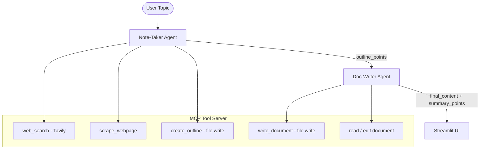

# DeepDraft — Multi-Agent Research & Writing (MCP + LangGraph)

DeepDraft is a **multi-agent system** that takes a topic, automatically researches the web, creates an outline, writes a full document, and then summarizes it — using LangGraph agents, a Model Context Protocol (MCP) tool server, and a Streamlit UI.

> Skills: multi-agent orchestration, MCP tool server, LangGraph graphs, Streamlit UI.
---

## What It Does

Instead of one large LLM prompt, this system breaks work into **specialized agents** that run in sequence:

1. **Note-Taker Agent** → Takes the user topic, builds a clean structured outline
2. **Doc-Writer Agent** → Uses the outline to write a full, formatted document
3. **Summary Agent** → Extracts 5–8 key bullet-point takeaways

All agents communicate through a shared **MCP server** that exposes controlled tools (web search, web scraping, file read/write) — agents cannot access the internet or filesystem directly.

---

## Architecture

```
User Input (Streamlit Chat)
        ↓
  Note-Taker Agent          ← LangGraph node: generates structured outline
        ↓                       calls MCP tools: web_search, scrape_webpage
  Doc-Writer Agent          ← LangGraph node: writes full document from outline
        ↓                       calls MCP tools: create_outline, write_document
  Summary Extraction        ← Extracts key points from final_content
        ↓
  Streamlit UI              ← Streams Outline → Full Document → Summary Points
        ↓
  MCP Server (Tool Layer)   ← web_search (Tavily) · scrape_webpage · file I/O
```

---

## Agent Pipeline



---

## Tech Stack

| Component         | Technology |
|-------------------|------------|
| Agent Orchestration | LangGraph (graph-based async agent execution) |
| Tool Server       | MCP (Model Context Protocol) |
| Web Search        | Tavily Search API |
| LLM               | Google Gemini (via LangChain) |
| UI                | Streamlit chat interface |
| Language          | Python 3.10+ (async/await throughout) |

---

## Project Structure

```
Multiagent_MCP/
├── app.py                  # Streamlit UI: chat loop, agent invocation, message rendering
├── main.py                 # CLI entry point
├── agents/
│   ├── note_taker_agent.py # Agent 1: research + outline generation
│   └── doc_writer_agent.py # Agent 2: full document writing + summary extraction
├── graph/                  # LangGraph graph definitions and state schemas
├── mcp_server/             # MCP tool server: web search, scraping, file I/O tools
├── client/                 # MCP client for agent-to-tool-server communication
├── temp/                   # Generated outputs: outline.txt, answer.txt
└── requirements.txt
```

---

## Setup & Run

```bash
# 1. Clone and install
git clone https://github.com/gnanadeep52/Multiagent_MCP.git
cd Multiagent_MCP
pip install -r requirements.txt

# 2. Create .env file
echo "GOOGLE_API_KEY=your_google_api_key" >> .env
echo "TAVILY_API_KEY=your_tavily_api_key" >> .env

# 3. Launch the Streamlit app
streamlit run app.py
```

Type any topic in the chat box. The system will stream back: **Outline → Full Document → Key Summary Points**.

---

## Key Design Decisions

**Why MCP instead of direct tool calls?**  
MCP creates a clean separation between agents (logic) and tools (capabilities). Agents cannot directly access the web or filesystem — they must go through the tool server. This mirrors production agentic architectures where tool access is auditable and controlled.

**Why LangGraph over a simple chain?**  
LangGraph allows stateful, conditional agent execution. Each node (agent) passes structured state forward, enabling the doc-writer to use the note-taker’s exact outline rather than re-generating it.

**Why async throughout?**  
Both agents run async to avoid blocking the Streamlit UI during long tool calls (web search, scraping). This keeps the interface responsive during multi-step generation.

---

## Sample Output

For topic: *"How does RAG work in production?"*

**Outline:**
- 1. What is RAG and why it matters
- 2. Core components: retriever, vector store, LLM
- 3. Production challenges: latency, freshness, evaluation
- 4. AWS Bedrock + OpenSearch production pattern
- 5. Monitoring and drift detection

**Full Document:** Complete markdown report (~800 words)  
**Key Summary Points:** 6 concise bullet takeaways

---

## References
- [MCP Documentation](https://modelcontextprotocol.io/docs/develop/build-server)
- [LangGraph Documentation](https://langchain-ai.github.io/langgraph/)
- [Tavily Search API](https://tavily.com/)
